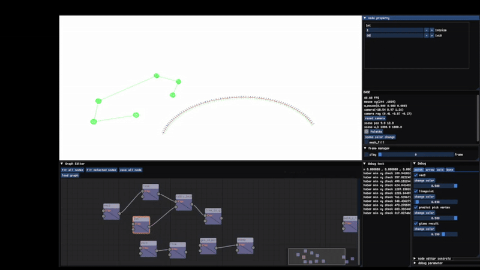

# node-based-modeling-opengl
node-based modeling tool developed for personal CG studies and experiments.  
This project is a work in progress, and features are still under development.
The node UI was developed based on ImGuizmo.

- save & load for all nodes and link
- Provides gizmo and UI controls that respond to the currently selected node

## Dependencies
- GLFW
- Glad
- ImGui
- ImGuizmo
- GLM
- stb_image

---

## Attribution

This project uses or is based on materials from **Joey de Vries**.

- Copyright © Joey de Vries  
- Source: [https://learnopengl.com](https://learnopengl.com)  
- Twitter: [@JoeyDeVriez](https://twitter.com/JoeyDeVriez)  
- Licensed under: [CC BY 4.0](https://creativecommons.org/licenses/by/4.0/)

---

## Models & Animation

- Character and animation assets from [Mixamo](https://www.mixamo.com/)