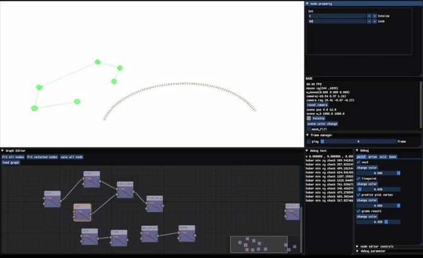

# node-based-modeling-opengl
node-based modeling tool developed for personal CG studies and experiments.  
This project is a work in progress, and many features are still under development.

# Features

- Full save & load support for all nodes and their connections
- Provides gizmo and UI controls that respond to the currently selected node

## Dependencies
- GLFW
- Glad
- ImGui
- ImGuizmo
- GLM
- stb_image

## References
- [LearnOpenGL](https://learnopengl.com/)  
